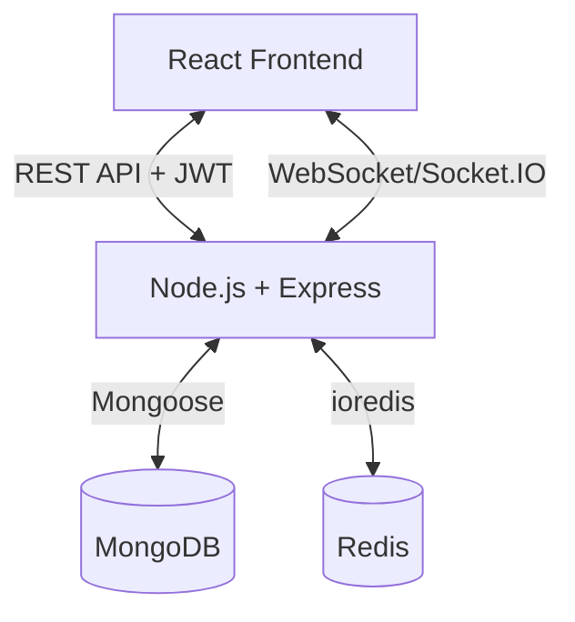

# Internal Project Management System (Real-Time Collaboration)

This repository contains the complete implementation for the Internal Project Management System, featuring a React frontend and a Node.js/Express backend with real-time Socket.IO collaboration.

---

## Phase 1: Planning (MANDATORY)

### A. Functional Requirement Document (FRD)

**Core Features:**
- **Authentication:** Secure user login and registration using JWT.
- **Project Management:** View a list of projects and create new ones.
- **Task Board (Kanban):** Manage tasks for specific projects with Todo, In Progress, and Done statuses.
- **Real-Time Collaboration:** Any task status changes are instantly broadcast to all other users currently viewing the same project board.

**User Roles & Permissions:**
- **User:** All authenticated users have access to all projects and can create/update tasks. (Role-based access control like Admin/Viewer is omitted to focus on real-time features).

**Assumptions:**
- Users will only move tasks across columns (changing status) and won't simultaneously edit the text of the same task.
- The company network handles standard WebSocket traffic without aggressive blocking.

**Out-of-scope Items:**
- Detailed user profiles and avatars.
- File attachments on tasks.
- Complex reporting and analytics.
- Email notifications.

---

### B. System Design

**High-Level Architecture Diagram (Mermaid):**


**Architecture Overview & Design Decisions:**
- **Frontend (React + Vite + Redux Toolkit):** Built as a Single Page Application (SPA). Redux Toolkit manages global state and Socket.IO seamlessly dispatches actions to keep the task board updated without unnecessary API polling.
- **Backend (Node.js + Express):** A clean service-layer architecture separates routes, controllers, and business logic (services).
- **Real-Time Strategy:** Socket.IO is used. When a user connects to a project board, they join a Socket.IO "room" uniquely identified by the `projectId`. When a task is updated, an event is emitted exclusively to that room to minimize unnecessary network traffic to clients on other projects.
- **Why this approach?** This architecture scales horizontally. Socket.IO provides built-in fallback to HTTP long-polling and room management. A service-layer backend ensures business logic is reusable across REST controllers and WebSocket handlers.

**Scalability Considerations:**
- **Redis:** Used to cache the projects list to reduce database load. Redis can also be utilized as a `socket.io-redis` adapter in the future to scale WebSockets across multiple Node.js instances.
- **Database:** MongoDB's document model allows flexible schemas, making it easy to add new task attributes later.

---

### C. Database Schema (MongoDB Collections)

**User Collection**
- `_id`: ObjectId
- `email`: String (Unique)
- `password`: String (Hashed)
- `name`: String

**Project Collection**
- `_id`: ObjectId
- `name`: String
- `description`: String

**Task Collection**
- `_id`: ObjectId
- `title`: String
- `description`: String
- `status`: String (Enum: 'TODO', 'IN_PROGRESS', 'DONE')
- `projectId`: ObjectId (Ref -> Project)

---

### D. API List

| Endpoint | Method | Purpose |
|----------|--------|---------|
| `/api/auth/login` | POST | Authenticate user and return JWT |
| `/api/auth/register` | POST | Register a new user |
| `/api/projects` | GET | Get all projects (Redis Cached) |
| `/api/projects` | POST | Create a new project |
| `/api/projects/:id/tasks` | GET | Get all tasks for a specific project |
| `/api/projects/:id/tasks` | POST | Create a new task in a project |
| `/api/tasks/:id` | PATCH | Update a task's status |
| `/api/tasks/:id` | DELETE | Delete a task |

---

### E. Socket Events List

| Event Name | Direction | Purpose |
|------------|-----------|---------|
| `joinProject` | Client -> Server | Connect client to a specific project room |
| `leaveProject` | Client -> Server | Disconnect client from a project room |
| `taskUpdated` | Server -> Client | Broadcasts to the room that a task status changed |
| `taskCreated` | Server -> Client | Broadcasts that a new task was added |
| `taskDeleted` | Server -> Client | Broadcasts that a task was removed |

---

## Local Setup

### 1. Prerequisites
- Node.js (v18+)
- MongoDB running locally or on Atlas.
- Redis running locally or on cloud.

### 2. Backend Setup
1. `cd backend`
2. `npm install`
3. Create a `.env` file in the `backend` folder:
   ```env
   PORT=5000
   MONGO_URI=mongodb://localhost:27017/project_management
   REDIS_URL=redis://localhost:6379
   JWT_SECRET=supersecretkey
   ```
4. `npm run dev`

### 3. Frontend Setup
1. Return to the root folder (`cd ..`)
2. `npm install`
3. Create a `.env` file in the root folder:
   ```env
   VITE_API_URL=http://localhost:5000/api
   VITE_SOCKET_URL=http://localhost:5000
   ```
4. `npm run dev`

---

## Deployment Steps (Phase 4)

To deploy the backend on a non-AWS VM (e.g. DigitalOcean):

1. **Provision VM**: Setup an Ubuntu VM. Install Node.js, MongoDB, Redis, and Nginx.
2. **Clone Repo**: Clone this repository to `/var/www/assignment`.
3. **PM2 Setup**: 
   - `cd /var/www/assignment/backend`
   - `npm install`
   - `pm2 start server.js --name "api-backend"`
4. **Nginx Reverse Proxy**:
   Create `/etc/nginx/sites-available/backend`:
   ```nginx
   server {
       listen 80;
       server_name api.yourdomain.com;

       location / {
           proxy_pass http://localhost:5000;
           proxy_http_version 1.1;
           proxy_set_header Upgrade $http_upgrade;
           proxy_set_header Connection 'upgrade';
           proxy_set_header Host $host;
           proxy_cache_bypass $http_upgrade;
       }
   }
   ```
5. **SSL (Let's Encrypt)**:
   - `sudo certbot --nginx -d api.yourdomain.com`
6. **Frontend**: The frontend can be built (`npm run build`) and served via Nginx, or deployed to Vercel/Netlify.

---

## URLs (To be updated upon deployment)
- **Deployed Frontend URL:** `TBD`
- **Deployed Backend URL:** `TBD`
- **Loom Video Link:** `TBD`

---

## AI Usage Declaration
*This project was developed with the assistance of an AI coding agent (Antigravity by Google Deepmind) for scaffolding the React Redux application, setting up the Node.js/Express service architecture, configuring Socket.IO integrations, writing boilerplate styling, and drafting this documentation. The AI was directed and guided throughout the entire process by the developer, and all generated code is fully understood and maintainable.*
